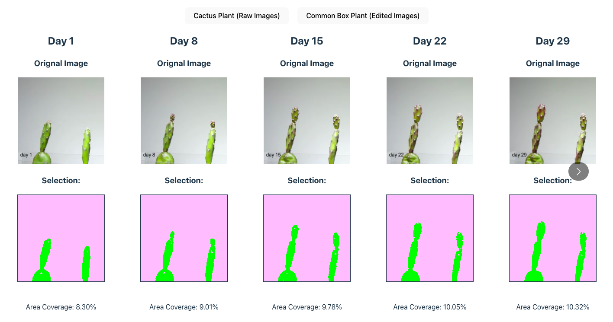

<h1>React Plant Track</h1>
      

        <h2>Overview</h2>
        <ul>
          <li>
            React Plant Track (RPT) is a tool that analyzes plant growth by extracting image data and comparing the values of each pixel.
          </li>
          <li>
            This is done entirely in the browser using the HTML canvas element and JavaScript.
          </li>
          <li>
            Uses of this tool include tracking the growth of plants in a greenhouse, or tracking the growth of a plant in a hydroponic system.
          </li>
          <li>
            By adjusting plant inputs and tracking the response, the user can determine the optimal conditions for the plant to grow in.
          </li>
        </ul>
      

      

        <h2>Methodology</h2>
        
The HTML canvas element converts images into data that can be measured and manipulated. 
          The data is stored in an array, where every four elements in the array represents a pixel.
          Each pixel contains an RGB value, which can be used to determine the color of the pixel, and the alpha value, which can be used to determine the opacity of the pixel. 
        

      

      

        <h2>Examples</h2>
        

          The first set of images were modified from a single image using Photoshop.
          To make the app more similar to a real life scenario, the second set of images were taken from a timelapse video of real plant.
        

         
        
      
